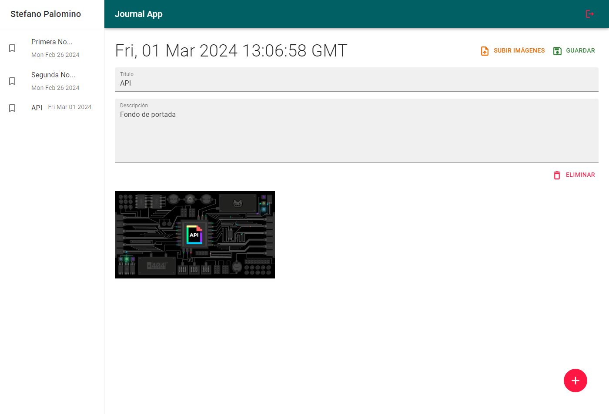

# Journal App



Aplicación web para escribir notas personales. La aplicación cuenta con un sistema de autenticación de usuario y protección de rutas. Además, cuenta con un sistema de creación, edición y eliminación de notas.

## Instalación

<<<<<<< HEAD
Instala las dependencias del proyecto con:
=======
Primero, instala las dependencias del proyecto con:
>>>>>>> 1cbbe3036f69369211ffd4bc4658429eddeac245

```bash
yarn add
```

Luego, copia el archivo .env.template a un nuevo archivo llamado .env.local y .env.test para las variables de desarrollo y prueba respectivamente.

## Ejecución

Para ejecutar el proyecto en modo de desarrollo, usa:

```bash
yarn dev
```

## Pruebas

Para ejecutar las pruebas, usa:

```bash
yarn test
```
<<<<<<< HEAD

## Tecnologías

- React
- React Router
- Redux
- Material UI
- Firebase
=======
>>>>>>> 1cbbe3036f69369211ffd4bc4658429eddeac245
